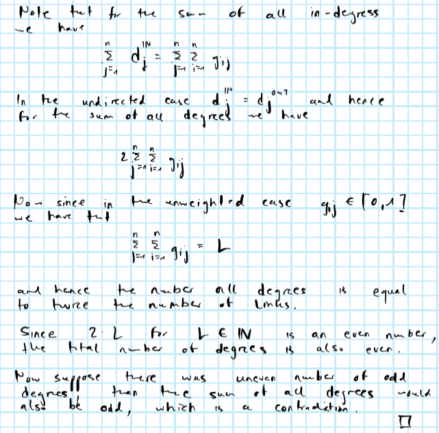
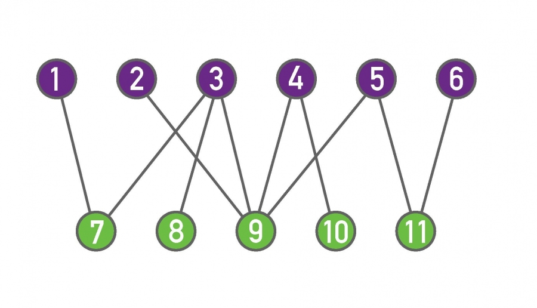
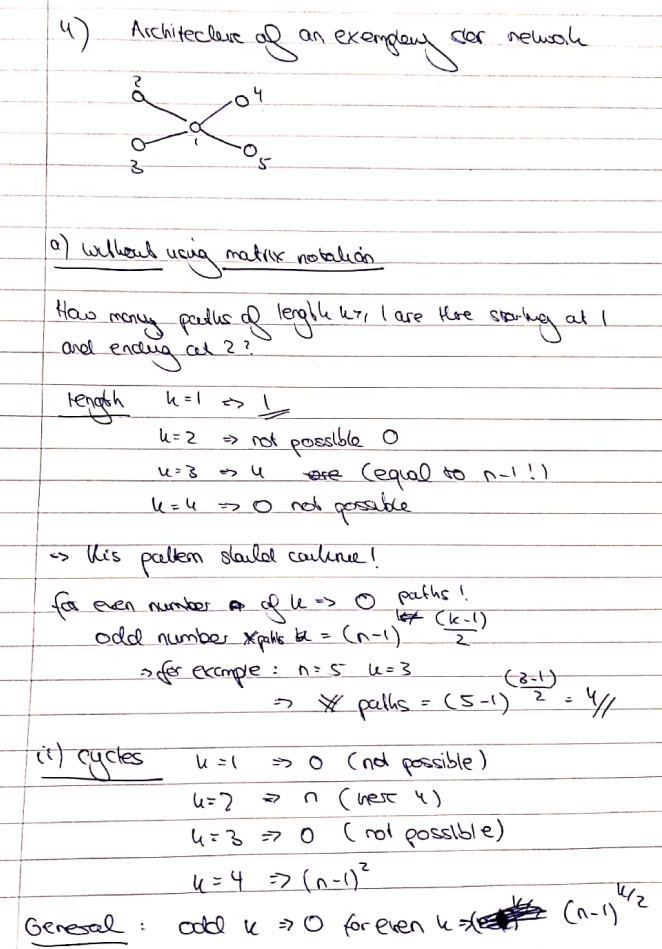
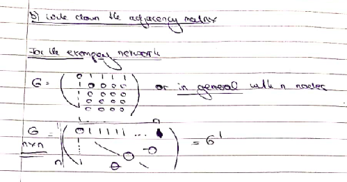
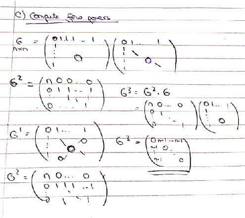
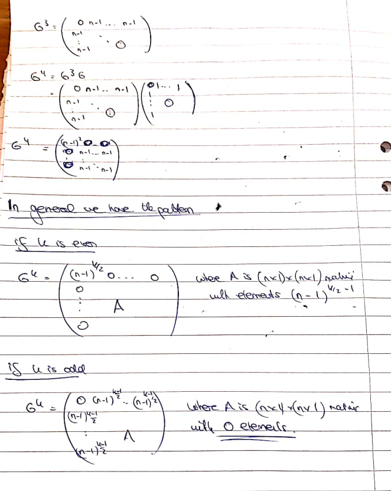
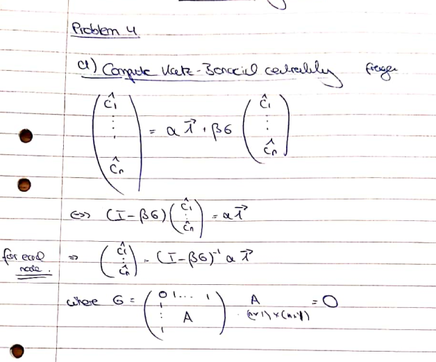
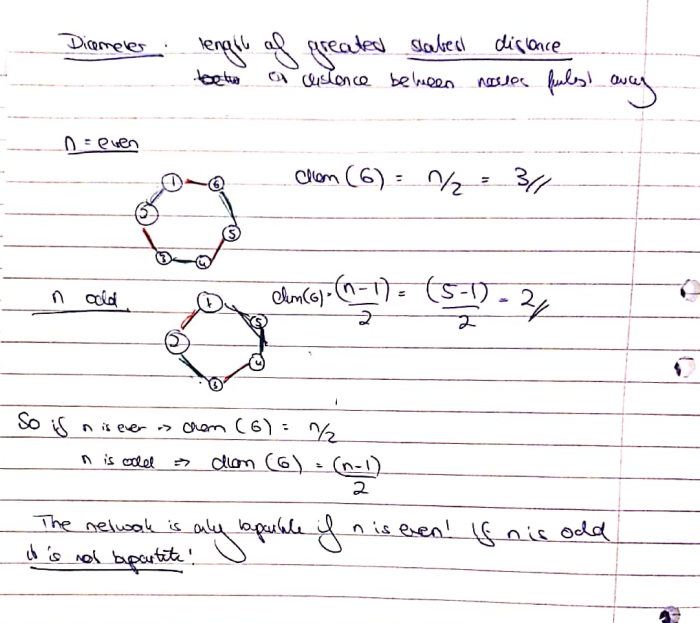

```{r setup, include=FALSE}
rm(list=ls())
knitr::opts_chunk$set(echo = FALSE, message = FALSE)
library(data.table)
helper_functions <- list.files("R")
lapply(
  helper_functions,
  function(i) {
    source(file = file.path("R",i))
  }
)
```


# Problem 1

Let’s consider here some properties of degrees in undirected and unweighted networks without self-loops. We are going to use the following notation: $n$ number of nodes; $L$ number of undirected links. Prove the following properties:

## a) 

The number of nodes with odd degree is even.

<hr>



## b)

There are always at least two nodes with same degree.

<hr>


# Problem 2

Given the adjacency matrix $G$ of a directed and unweighted network, provide an interpretation for the entries in the matrices $GG^T$ and $G^TG$, where $G^T$ is the transpose of $G$. Make use of a small (not more than ten nodes) directed network to illustrate numerically the differences between both matrices.

<hr>

Consider the following graph

```{r}
library(igraph)
g <- graph_from_literal(
  A -+ B,
  A -+ C -+ D -+ E,
  B -+ D,
  F -+ E
)
plot(g)
```

and its corresponding adjacency matrix:

```{r, results='asis'}
G <- as.matrix(as_adjacency_matrix(g))
G_lat <- matrix2latex(G)
```

$$
\begin{equation} 
\begin{aligned}
&& G&=`r G_lat`\\
\end{aligned}
(\#eq:G)
\end{equation}
$$

Then we have for the two crossproducts we have

```{r}
GtG <- crossprod(G)
GGt <- crossprod(t(G))
GtG_lat <- matrix2latex(GtG)
GGt_lat <- matrix2latex(GGt)
```

$$
\begin{equation} 
\begin{aligned}
&& GG^T&=`r GGt_lat` \\
\end{aligned}
(\#eq:GGt)
\end{equation}
$$

and 

$$
\begin{equation} 
\begin{aligned}
&& G^TG&=`r GtG_lat` \\
\end{aligned}
(\#eq:GtG)
\end{equation}
$$

This example illustrates nicely how we can interpret elements in \@ref(eq:GGt) and \@ref(eq:GtG). With respect to \@ref(eq:GGt), firstly note that the elements on the diagonal correspond to the out-degrees of nodes: for example, the out-degree of node $A$ is equal to `r as.numeric(diag(GGt)["A"])`, while the out-degree of $E$ is `r as.numeric(diag(GGt)["E"])`. Off-diagonal elements in \@ref(eq:GGt) indicate the number of outgoing nodes that $j$ and $i$ share: for example, nodes $B$ and $C$ share `r GGt["B","C"]` node. With respect to \@ref(eq:GtG) the narrative is very similar, except that everything revolves around in-degrees: diagonal elements reveal the number in-degrees of nodes, while off-diagonal elements indicate how many ingoing nodes $j$ and $i$ share.

# Problem 3

Read the section on bipartite networks in Barabasi, chapter 2, and solve the two problems on bipartite networks at the end of the chapter.

<hr>

## a)

Consider the bipartite network of Image 2.21



### (i)

Construct its adjacency matrix. Why is it a block-diagonal matrix?

<hr>

```{r}
d <- 11
G <- matrix(rep(0,d^2),d)
G[1,7] <- 1
G[2,9] <- 1
G[3,c(7,8,9)] <- 1
G[4,c(9,10)] <- 1
G[5,c(9,11)] <- 1
G[6,11] <- 1
G <- G + t(G)
G_lat <- matrix2latex(G)
```

The adjacency matrix

$$
\begin{equation} 
\begin{aligned}
&& G&=`r G_lat` \\
\end{aligned}
(\#eq:bipartite)
\end{equation}
$$

is block-diagonal, because it by construction its nodes can be divided into two disjoint sets $U=\{1,2,3,4,5,6\}$ and $V=\{7,8,9,10,11\}$. In other words, nodes in $U$ are connected only to nodes in $V$ and vice-versa. 

### (ii)

Construct the adjacency matrix of its two projections, on the purple and on the green nodes, respectively.

<hr>

```{r, echo=TRUE}
G_U <- crossprod(t(G[1:6,7:11]))
diag(G_U) <- 0
G_U_lat <- matrix2latex(G_U)
```

The adjacency matrix of the purple projection is

$$
\begin{equation} 
\begin{aligned}
&& G_U&=`r G_U_lat` \\
\end{aligned}
(\#eq:purple)
\end{equation}
$$

which can be computed as $\{G\}_{(1:6,7:11)}\{G\}_{(1:6,7:11)}^T$ and then setting diagonal elements to zero.

```{r, echo=TRUE}
G_V <- crossprod(t(G[7:11,1:6]))
diag(G_V) <- 0
G_V_lat <- matrix2latex(G_V)
```

The adjacency matrix of the purple projection is

$$
\begin{equation} 
\begin{aligned}
&& G_V&=`r G_V_lat` \\
\end{aligned}
(\#eq:green)
\end{equation}
$$

which can be computed as $\{G\}_{(7:11,1:6)}\{G\}_{(7:11,1:6)}^T$ and then setting diagonal elements to zero.

### (iii)

Calculate the average degree of the purple nodes and the average degree of the green nodes in the bipartite network.

<hr>

Average degrees can be computed as $\frac{1}{6}\{\mathbf{1}_d^T G \mathbf{1}_d\}_{(1:6,7:11)}$ and $\frac{1}{5}\{\mathbf{1}_d^T G \mathbf{1}_d\}_{(7:11,1:6)}$, respectively:

```{r}
library(kableExtra)
degrees <- data.table(d = c(G %*% rep(1,ncol(G))), set=c(rep("U",6),rep("V",5)))
kable(degrees[,.(avg=mean(d)),by=set], col.names=c("Set", "Avg. degree"))
```

### (iv)

Calculate the average degree in each of the two network projections. Is it surprising that the values are different from those obtained in point (iii)?

<hr>

Average degrees can be computed as $\frac{1}{d} ( \mathbf{1}_d^T G_S \mathbf{1}_d)$ where $S\in\{U,V\}$:

```{r, echo=TRUE}
avg_d_U <- as.numeric(rep(1,ncol(G_U)) %*% G_U %*% rep(1,ncol(G_U))/ncol(G_U))
avg_d_V <- as.numeric(rep(1,ncol(G_V)) %*% G_V %*% rep(1,ncol(G_V))/ncol(G_V))
```

This yields $\bar{d}_U=`r avg_d_U`$ and $\bar{d}_V=`r avg_d_V`$. It is not surprising that they differ. Consider this simple, but illustrative example of a bipartite network: let $U={A,B}$ and $V=[1,100]$ and suppose each node in $V$ is connected to $A$, with only node $1$ connected to $B$. Then clearly $A$'s degree within the whole network is 100 and $B$'s degree is one. Within the projection of $U$ both $A$ and $B$ have the same degree 1. 

## b)

Consider a bipartite network with $N_1$ and $N_2$ nodes in the two sets.

### (i)

What is the maximum number of links $L_{max}$ the network can have?

<hr>

Since nodes within the two disjoint sets cannot be connected to each other, but there can be arbitrarily many links between the two sets: $L\le N_1N_2$ and hence $L_{max}=N_1N_2$.

### (ii)

How many links cannot occur compared to a non-bipartite network of size $N = N_1 + N_2$?

<hr>

For a non-bipartite network we have $\tilde{L}_{max}=\binom{N_1+N_2}{2}= \frac{(N_1+N_2)(N_1+N_2-1)}{2}$. By expanding the product, this can be rearranged as follows:

$$
\begin{aligned}
&& \tilde{L}_{max}&=\frac{N_1(N_1-1)+N_1N_2+N_2(N_2-1)+N_2N_1}{2} \\
&& &= \frac{N_1(N_1-1)+N_2(N_2-1)}{2} + N_1N_2 \\
&& &= \binom{N_1}{2} + \binom{N_2}{2} + N_1N_2\\
&& \tilde{L}_{max}&= \binom{N_1}{2} + \binom{N_2}{2} + L_{max} \\
\end{aligned}
$$
Hence, the number of links that cannot occure in a bipartite network compared to a non-bipartite network is simply equal to $\Delta=\binom{N_1}{2} + \binom{N_2}{2}$

### (iii)

If $N1<<N2$ , what can you say about the network density, that is the total number of links over the maximum number of links, $L_{max}$?

<hr>

The smaller the ratio $\frac{N_1}{N_2}$ where $N_1<N2$ (or equivalently the smaller $\frac{N_2}{N_1}$ where $N_2<N_1$), the smaller $L_{max}$.

### (iv)

Find an expression connecting $N1$, $N2$ and the average degree for the two sets in the bipartite network, $〈k1〉$ and $〈k2〉$.

<hr>

As per above, we can denote more generally

$$
\begin{aligned}
&& 〈k1〉&=\frac{1}{N_1}\{\mathbf{1}_d^T G \mathbf{1}_d\}_{(1:N_1,(N_1+1):N)} \\
&& 〈k2〉&=\frac{1}{N_2}\{\mathbf{1}_d^T G \mathbf{1}_d\}_{( (N_1+1):N, 1:N_1)} \\
\end{aligned}
$$

where $G$ is the adjacency matrix. Alternatively, we can use a notation in terms of sums:

$$
\begin{aligned}
&& 〈k1〉&=\frac{1}{N_1}\sum_{i \in U} \sum_{j \in V} g_{ij} \\
&& 〈k2〉&=\frac{1}{N_2} \sum_{j \in V} \sum_{i \in U} g_{ji} \\
\end{aligned}
$$

# Problem 4

Consider the star network, in which there are n nodes with node 1, the hub, connected to all other nodes, the spokes, and the spokes are only connected to the hub. There are no self-loops.

## a)

<hr>



## b)
Write down the adjacency matrix G of this network.

<hr>




## c)

Compute a few powers of the adjacency matrix and obtain a general expression(s) for all powers G k , k ≥ 1.

<hr>


<hr>



## d)

Use the previous section to compute the Katz-Bonacich centrality of each node for general values of α and β.
CHECK!




## e)

Now compute again the Katz-Bonacich centrality of each node by directly solving the linear system equations that characterizes it, and check that you obtain the same result as in the previous section.

TODO!

# Problem 5

Consider a network with the following adjacency matrix

```{r}
d <- 8
G <- matrix(rep(0,d*d),d)
G[1,c(4,7)] <-  1
G[2,c(3,5,6)] <-  1
G[3,2] <- 1
G[4,c(1,7,8)] <-  1
G[5,c(2,6)] <-  1
G[6,c(2,5)] <-  1
G[7,c(1,4,8)] <-  1
G[8,c(4,7)] <-  1
g <- graph_from_adjacency_matrix(G)
G_lat <- matrix2latex(G)
```

$$
\begin{equation} 
\begin{aligned}
&& G&=`r G_lat` \\
\end{aligned}
(\#eq:G5)
\end{equation}
$$

## a)

How many components there are in this network?

<hr>

There are two components in the network:

```{r}
plot(g)
```


## b)

```{r}
l <- 7
library(expm)
n_paths <- G %^% l
```

There are `r n_paths[1,5]` paths of length `r l` from node 1 to 5 (these nodes are in different components). There are `r n_paths[1,8]` paths of length `r l` from node 1 to 8. This values corresponds to the $ij$-th element of $G^{l=7}_{(1,8)}$.

## c)

Given parameters $α$ and $β$, compute the Katz-Bonacich centrality of each node.

<hr>

We implement Katz-Bonacich as follows:

```{r, code=readLines("R/utils.katz_bonacich.R"),eval=F,echo=T}
```

Below we plot the resulting centrality measures for three different values of $\beta$ (columns) and varying degrees of $\alpha$ (Figure \@ref(fig:centr)). Evidently the relative ranking in terms of centrality is consistent across parameter choices.

```{r centr, fig.height=3, fig.width=9, fig.cap="Katz-Bonacich centrality for different parameter choices."}
library(ggplot2)
alpha <- seq(0.5,2,length.out=5)
beta <- seq(0.15,0.35,length.out=3)
grid <- data.table(expand.grid(alpha=alpha,beta=beta))
output <- rbindlist(
  lapply(
    1:nrow(grid),
    function(i) {
      list2env(c(grid[i,]), envir = environment())
      centr <- katz_bonacich(alpha,beta,G)
      data.table(alpha=alpha, beta=beta, centr=centr, node=1:length(centr))
    }
  )
)
p <- ggplot(data=output, aes(x=node, y=centr, colour=factor(alpha))) +
  geom_line() +
  geom_point() +
  scale_color_discrete(name="Alpha:") +
  facet_grid(
    cols = vars(beta)
  ) +
  labs(
    x="Node",
    y="Centrality"
  )
p
```

## d)

Order nodes according to Katz-Bonacich centrality for the particular case in which $α=2$ and $β=0.25$. Would it change anything in this order if we change $α=2$ for some other strictly positive number?

<hr>

In this case the order is as follows:

```{r, results='asis'}
kable(output[alpha==2 & beta==0.25][order(-centr)][,.(centr,node)], col.names = c("Centrality","Node"), digits = 2)
```


As evident from Figure \@ref(fig:centr) above, the effect of $\alpha$ is purely scaling, so nothing would change with respect to the relative ordering.

## e)

Compute the eigenvector centrality of each node. You can use a computer to make computations but you cannot directly use some network analysis software with a build function to compute this directly. Explain the steps you follow.

<hr>

Given $G$ is a positive matrix, it suffices to find its leading eigenvalue $\lambda$. The by the Perron-Frobenius (PF) theorem there exists a positive eigenvector $v$. Hence we simply proceed as follows: 

1. Eigen-decompose $G$.
2. Find the eigenvector $v$ corresponding to the leading eigenvalue $\lambda$. By the PF theorem the there exists a an eigenvector $\tilde{v}$ that only has non-negative entries. Consequently, $v$ can be either all positive or all negative and hence we simply take element-wise absolute values to ensure the former. 3. Finnaly we scale $\tilde{v}$ such that its largest element is equal to 1. 

In R we implement this as follows:

```{r, code=readLines("R/utils.centrality_eigen.R"),eval=F,echo=T}
```
 
```{r}
centr <- centrality_eigen(G)
kable(data.table(centr = centr, node = 1:length(centr))[order(-centr)], col.names = c("Centrality","Node"), digits = 2)
```


# Problem 6

## a)

Consider the following network, that we are going to call a circle: node 1 is connected to node n and node 2, node 2 is connected to node 1 and node 3, node 3 is connected to node 2 and node 4,..., node n is connected to node n-1 and node 1. What is the diameter of that network? Is that network bipartite?

<hr>


## b)

Find a network with largest possible diameter within the set of networks that have n nodes and just one single component.

<hr>


## c)

Find a network with smallest possible diameter within the set of networks that have n nodes and just one single component.

<hr>


## d)

Find an undirected network with one single component in which the diameter is 4 times larger than the average distance.

<hr>


# Problem 7

Find the dataset about jazz musicians, from the paper P.Gleiser and L. Danon , Adv. Complex Syst.6, 565 (2003). Using some software for network analysis:

```{r}
load("data/jazz.rda")
G <- Jazz
rm(Jazz)
g <- graph_from_adjacency_matrix(G)
bands <- data.table(band=1:ncol(G))
```

## a)

Compute the degree centrality of each node.

<hr>

Degree centrality can be implemented in R as follows:

```{r, code=readLines("R/utils.centrality_degree.R"),eval=F,echo=T}
```

Below we compute the degree centralities of the nodes and store them in a data frame.

```{r, echo=TRUE}
centr <- centrality_degree(G)
bands[,centr_degree:=centr]
```

## b) 

Compute the eigenvector centrality of each node.

<hr>

Below we compute the eigenvector centralities of the nodes and store them in the same data frame.

```{r, echo=TRUE}
centr <- centrality_eigen(G)
bands[,centr_eigen:=centr]
```


## c)

Compare the top 10 nodes according to the previous two centrality measures.

<hr>

### TODO

## d)

Compute the individual clustering coefficients of each node, and the average clustering coefficient. Compare this average clustering to the ratio $L/\begin{pmatrix}n \\2\end{pmatrix}$ of that network.

<hr>

### TO FINISH

```{r, echo=TRUE}
clust_coeff <- transitivity(g, type="local")
bands[,clust:=clust_coeff]
clust_avg <- transitivity(g)
n <- nrow(G)
L <- sum(G %*% rep(1, nrow(G)))
ratio <- L/choose(n,2)
```


