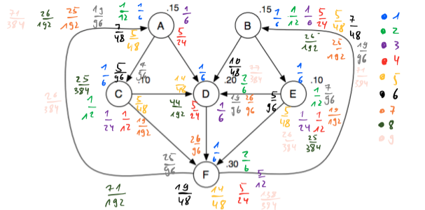

```{r setup, include=FALSE}
rm(list=ls())
knitr::opts_chunk$set(echo = FALSE, message = FALSE)
library(data.table)
library(expm)
helper_functions <- list.files("R")
lapply(
  helper_functions,
  function(i) {
    source(file = file.path("R",i))
  }
)
```

# 1.)

Check whether the networks in Figures 14.19, 14.20, and 14.21 in @easley2010networks, ch. 14, are strongly connected and aperiodic. For the ones that satisfy both properties, find the PageRank equilibrium values of all nodes (without the use of a computer; explain the steps you follow).

<hr>

Let $\mathbf{T}$ denote the transition matrix. If the network is

-   strongly connected: $\exists$ a path connecting $i \rightarrow j$ for all $i,j\in N$
-   aperiodic: greatest common divisor (of the lengths of cycles) is equal to 1

then there exists an equilibrium formulation of PageRank:

$$
\begin{equation} 
\begin{aligned}
&& \mathbf{r}&=\mathbf{T}^T\mathbf{r} \\
\end{aligned}
(\#eq:equi)
\end{equation}
$$

The networks we are asked to analyse are shown below in Figures (\@ref(fig:net19)) to (\@ref(fig:net21)). It is straight-forward to see that all of them are strongly connected. In other words, for none of the networks can we find a single node from which we cannot reach all other nodes. With respect to aperiodicity, we can establish the following: in Figure (\@ref(fig:net19)) there are cycles of length 3 and length 4, hence the network is aperiodic; in Figure (\@ref(fig:net20)) there are multiple cycle of length $l=3$ and no cycles of other lengths, such that the greatest common divisor is 3 and the network in not aperiodic; finally in Figure (\@ref(fig:net21)) there are cycles of length 3 and 4, hence the network is aperiodic just like the one in (\@ref(fig:net19)).

```{r net19, fig.cap="Network 14.19 in @easley2010networks."}
knitr::include_graphics("www/ps2_1_19.png")
```

```{r net20, fig.cap="Network 14.20 in @easley2010networks."}
knitr::include_graphics("www/ps2_1_20.png")
```

```{r net21, fig.cap="Network 14.21 in @easley2010networks."}
knitr::include_graphics("www/ps2_1_21.png")
```

Now we are asked to derive the steady-state PageRank by hand. We have tried to do this below for the network in Figure (\@ref(fig:net21)). As you can see the numbers seem to be converging somewhere, but after 9 painful iterations we gave up. 

```{r net21-manual, fig.cap="Network 14.21 in @easley2010networks."}

```

```{r g21}
d <- 6
G <- matrix(rep(0,d^2),d)
G[1,c(3,4)] <- 1
G[2,c(4,5)] <- 1
G[3,c(4,6)] <- 1
G[4,6] <- 1
G[5,c(4,6)] <- 1
G[6,c(1,2)] <- 1
d_out <- diag(crossprod(t(G)))
T_ <- G / d_out
T_lat <- matrix2latex(T_)
```

As a sanity check we wrote a program in R that simply takes powers of the transition matrix and eventually converges to a steady state. Remaining with the network in Figure (\@ref(fig:net21)) for a moment, we have for the transition matrix:

$$
\begin{equation} 
\begin{aligned}
&& \mathbf{T}&=`r T_lat` \\
\end{aligned}
(\#eq:T-21)
\end{equation}
$$

Below we implement the small program:

```{r, echo=TRUE}
T_temp <- T_
tol <- 1e-9
k <- 2
converged <- FALSE
while(!converged) {
  T_new <- T_%^%k
  converged <- all(abs(T_temp - T_new) < tol)
  T_temp <- T_new
  k <- k + 1
}
r <- diag(T_temp)
r_lat <- matrix2latex(matrix(r))
```

It converges after $k=`r k`$ iterations. In other words we have $T^{(k+s)}=T^k$ for all $s>0$ and $k=`r k`$. A steady-state solution for the PageRank is given by the diagonal elements of $T^{`r k`}$, namely:

$$
\begin{equation} 
\begin{aligned}
&& \mathbf{r}&=\mathbf{T}^T\mathbf{r}=`r r_lat` \\
\end{aligned}
(\#eq:pr)
\end{equation}
$$

As a final sanity check we can also use the `igraph` package

```{r, echo=TRUE}
library(igraph)
g <- graph_from_adjacency_matrix(G)
r_igraph <- page_rank(g)$vector
r_lat <- matrix2latex(matrix(r_igraph))
```

which yields a similar result:

$$
\begin{equation} 
\begin{aligned}
&& \mathbf{r}_{\text{igraph}}&=`r r_lat` \\
\end{aligned}
(\#eq:pr)
\end{equation}
$$
```{r g19}
d <- 5
G <- matrix(rep(0,d^2),d)
G[1,c(2,3,4)] <- 1
G[2,c(3,5)] <- 1
G[3,c(5)] <- 1
G[4,c(3,5)] <- 1
G[5,c(1)] <- 1
d_out <- diag(crossprod(t(G)))
T_ <- G / d_out
T_temp <- T_
tol <- 1e-9
k <- 2
converged <- FALSE
while(!converged) {
  T_new <- T_%^%k
  converged <- all(abs(T_temp - T_new) < tol)
  T_temp <- T_new
  k <- k + 1
}
r <- diag(T_temp)
r_lat <- matrix2latex(matrix(r))
```


For the network in Figure (\@ref(fig:net19)) we have refrained from trying to derive the steady-state by hand and instead used our program directly. In this case it converges after $k=`r k`$ iterations and yields the following vector:

$$
\begin{equation} 
\begin{aligned}
&& \mathbf{r}&=\mathbf{T}^T\mathbf{r}=`r r_lat` \\
\end{aligned}
(\#eq:pr-19)
\end{equation}
$$

These values in fact correspond to the ones displayed in @easley2010networks.

# References
