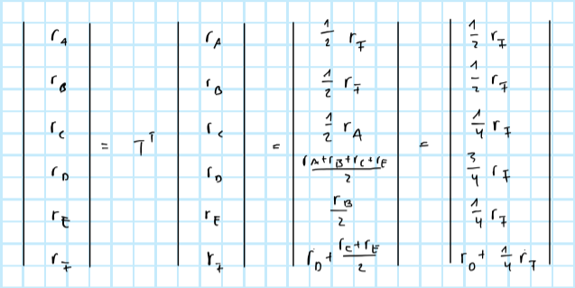

```{r setup, include=FALSE}
rm(list=ls())
knitr::opts_chunk$set(echo = FALSE, message = FALSE)
library(data.table)
library(expm)
library(igraph)
helper_functions <- list.files("R")
lapply(
  helper_functions,
  function(i) {
    source(file = file.path("R",i))
  }
)
```

# 1.)

Check whether the networks in Figures 14.19, 14.20, and 14.21 in @easley2010networks, ch. 14, are strongly connected and aperiodic. For the ones that satisfy both properties, find the PageRank equilibrium values of all nodes (without the use of a computer; explain the steps you follow).

<hr>

Let $\mathbf{T}$ denote the transition matrix. If the network is

-   strongly connected: $\exists$ a path connecting $i \rightarrow j$ for all $i,j\in N$
-   aperiodic: greatest common divisor (of the lengths of cycles) is equal to 1

then there exists an equilibrium formulation of PageRank:

$$
\begin{equation} 
\begin{aligned}
&& \mathbf{r}&=\mathbf{T}^T\mathbf{r}, & \mathbf{r}^T\mathbf{1}=1  \\
\end{aligned}
(\#eq:equi)
\end{equation}
$$

The networks we are asked to analyse are shown below in Figures (\@ref(fig:net19)) to (\@ref(fig:net21)). It is straight-forward to see that all of them are strongly connected. In other words, for none of the networks can we find a single node from which we cannot reach all other nodes. With respect to aperiodicity, we can establish the following: in Figure (\@ref(fig:net19)) there are cycles of length 3 and length 4, hence the network is aperiodic; in Figure (\@ref(fig:net20)) there are cycles of length $3$ and $6$ hence the network is not aperiodic; finally in Figure (\@ref(fig:net21)) there are cycles of length 3 and 4, hence the network is aperiodic just like the one in (\@ref(fig:net19)).

```{r net19, fig.cap="Network 14.19 in @easley2010networks."}

```

```{r net20, fig.cap="Network 14.20 in @easley2010networks."}

```

```{r net21, fig.cap="Network 14.21 in @easley2010networks."}
knitr::include_graphics("www/ps2_1_21.png")
```

Now we are asked to derive the steady-state PageRank by hand. To do so we can simply solve the system of equations defined in \@ref(eq:equi) each time.

```{r t19}
d <- 5
G <- matrix(rep(0,d^2),d)
G[1,c(2,3,4)] <- 1
G[2,c(3,5)] <- 1
G[3,c(5)] <- 1
G[4,c(3,5)] <- 1
G[5,c(1)] <- 1
d_out <- diag(crossprod(t(G)))
T_19 <- G / d_out
T_lat <- matrix2latex(T_19)
```

For the network in Figure (\@ref(fig:net19)), the corresponding transition matrix is:

$$
\begin{equation} 
\begin{aligned}
&& \mathbf{T}&=`r T_lat` \\
\end{aligned}
(\#eq:t19)
\end{equation}
$$

We can then solve $\mathbf{T}^T\mathbf{r}$ as follows:

```{r net19-sol, fig.cap="Derivation of steady-state of network 14.19 in @easley2010networks."}
knitr::include_graphics("www/ps2_1_19_sol.png")
```

Noting that we need to have $(\mathbf{T}^T\mathbf{r})^T\mathbf{1}=1$, we get a solution for $r_A$ which can then be used to solve for all other elements. In particular, we have for the steady-state PageRank vector: $\mathbf{r}^T=\frac{1}{10}(3,1,2,1,3)$, where the first entry corresponds to node $A$ and the last to node $E$.

```{r g21}
d <- 6
G <- matrix(rep(0,d^2),d)
G[1,c(3,4)] <- 1
G[2,c(4,5)] <- 1
G[3,c(4,6)] <- 1
G[4,6] <- 1
G[5,c(4,6)] <- 1
G[6,c(1,2)] <- 1
d_out <- diag(crossprod(t(G)))
T_21 <- G / d_out
T_lat <- matrix2latex(T_21)
```

Similarly, for the network in Figure (\@ref(fig:net21)) we have

$$
\begin{equation} 
\begin{aligned}
&& \mathbf{T}&=`r T_lat` \\
\end{aligned}
(\#eq:t21)
\end{equation}
$$

which solves to 

```{r net21-sol, fig.cap="Derivation of steady-state of network 14.21 in @easley2010networks."}

```

and hence $\mathbf{r}^T= \frac{1}{13}(2, 2,1,1,3,4)$ for the steady-state PageRank.

As a sanity check we wrote a program in R that simply takes powers of the transition matrix and eventually converges to a steady state:

```{r, code=readLines("R/utils.page_rank.R"), echo=TRUE, eval=FALSE}
```

We can apply this to the two transition matrices and see that it in fact yields the same solutions:

```{r}
trans_mats <- list(T_19,T_21)
output <- rbindlist(
  lapply(
    1:length(trans_mats),
    function(i) {
      T_ <- trans_mats[[i]]
      out <- page_rank(T_)
      return(data.table(network=i+18, page_rank=out$r, node=LETTERS[1:length(out$r)]))
    }
  )
)
kableExtra::kable(output, col.names = c("Network", "PageRank", "Node"), digits = 3)
```


# 2.)

## i)

Find all the maximal cliques in the following network. Explain how can you find this list without making use of a computer.

```{r net-clique, fig.cap="Networks."}

```

<hr>

```{r}


```

## ii)

Using the SocNetV we can see that the maximal cliques in the karate data set is 36. The co-membership matrix can be also easily obtained (see attached picture).

```{r}


```

For the interpretation, the diagonal elements of the symmetric co-membership matrix state how often a particular node is found in a maximal clique set. For example, node 1 is included 13 times in different maximal clique sets. The off-diagonal elements show how often element $i$ and $j$ occur together in a maximal clique set. For example, node 1 and 2 occurred 5 times together in different maximal clique sets.

# 4.)

```{r}
d <- 10
G <- matrix(rep(0,d^2),d)
G[1,c(2,3)] <- 1
G[2,c(1,3)] <- 1
G[3,c(1,2,4)] <- 1
G[4,c(3,5)] <- 1
G[5,c(4,6)] <- 1
G[6,c(5,7)] <- 1
G[7,c(6,8)] <- 1
G[8,c(7,9,10)] <- 1
G[9,c(8,10)] <- 1
G[10,c(8,9)] <- 1
g <- graph_from_adjacency_matrix(G, mode = "undirected")
```

## a)

By hand this can be done as follows:

```{r}


```

In R we could use `igraph::edge.betweenness.community(g)` to compute the optimal clustering based on modularity directly:

```{r}
plot_dendrogram(edge.betweenness.community(g),mode="hclust",use.modularity = TRUE)
```

## b)

In R `igraph::edge.betweenness.community(g)` chooses the partition with maximal modularity by default:

```{r, echo=TRUE}
clust <- edge.betweenness.community(g)
plot(g, mark.groups = clust, main=sprintf("Optimal modularity: %0.2f", modularity(g, membership = clust$membership)))
```

Computing the modularity by hand for each layer would be a tedious job, but we can make a few observations that simplify things.

```{r}


```

The values correspond to what `igraph` returns. Technically there are a few more intermediate layers we would have to check, but given we have already done this in R and identified the optimal layer, we skip this here (also to avoid repetition).

## c)

Manually this can be done as follows:

```{r}


```

In R we can simply proceed as below which yields Figure (\@ref(fig:com-lin)). The merging from bottom to top corresponds to the steps we derived manually.

```{r com-lin, fig.cap="Complete-linkage clustering."}
hc <- hclust(proxy::dist(G,method="jaccard"))
plot(hc)
```

Finally, we can also use R to compute the modularity at each step:

```{r, echo=TRUE}
step1 <- c(1,1,2,3,4,5,4,6,7,7)
step2 <- c(1,1,2,1,4,5,4,6,7,7)
step3 <- c(1,1,2,1,4,5,4,5,7,7)
step4 <- rep(1,10)
memberships <- list(
  step1,
  step2,
  step3,
  step4
)
output <- rbindlist(
  lapply(
    1:length(memberships),
    function(i) {
      M <- modularity(g,membership = memberships[[i]])
      data.table(step=i,modularity=M)
    }
  )
)
kableExtra::kable(output, col.names = c("Step", "Modularity"))
```


# References
