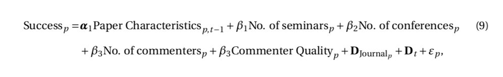
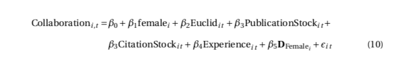

```{r setup, include=FALSE}
rm(list=ls())
knitr::opts_chunk$set(echo = FALSE, message = FALSE)
library(data.table)
library(expm)
library(igraph)
library(reticulate)
library(networkD3)
helper_functions <- list.files("R")
lapply(
  helper_functions,
  function(i) {
    source(file = file.path("R",i))
  }
)
```

@rose20185 set out to analyse how informal collaboration among scholars affects research outcomes. To do so they use a dataset comprising meta data of more than 5000 articles from the academic literature on Financial Economics published between 1997 and 2011. 
Although they are hesitant to draw and causal connections, the authors find significant links between informal networking - conferences, seminars and paper reviews - and the success of papers and ultimately researchers. The estimated relationships are stronger than for formal co-authorship, which had been the primary focus of previous research in the line of literature. Perhaps not surprisingly then, more than half of the papers analysed in @rose20185 involve all three kinds of informal collaboration. The findings set out in the paper are relevant not just to the hiring committees of academic institutions, but also young researchers at the beginning of their academic careers, who @rose20185 find to more actively seek informal collaboration than their predecessors. Perhaps their methodological and data work is an even more valuable contribution. Their network of informal collaborations is publicly available and can be used to understand the drivers of scientific productivity. More importantly, their methodology is reproducible and in fact has already been applied to other fields of science (@dong2021cross and @rose2020discussants).

In this short note I will first briefly summarize the methodology and data used in @rose20185. The following [section](findings) then summarizes their main empirical findings (section \@ref(findings)). The final [section](crit) offers a critical review of their work in context of the broader literature. 

## @rose20185

### Data and methodology {#data}

The network of informal collaboration in Financial Networks is a novel data set derived from the acknowledgement sections of over 5000 published research papers from three top journals -- The Journal of Finance, The Review of Financial Studies, the Journal of Financial Economics -- and three second-tier journals -- the Journal of Financial Intermediation, the Journal of Money, Credit & Banking, and the Journal of Banking and Finance. 
The raw data has been made freely [available](https://github.com/Michael-E-Rose/CoFE) along with a short demonstration of how to link authors and commenters in a graph. 

```{python, warnings=FALSE}
from json import loads
from urllib.request import urlopen
COFE = 'https://raw.githubusercontent.com/Michael-E-Rose/CoFE/master/acks_min.json'
acks = loads(urlopen(COFE).read().decode("utf-8"))['data']
```

```{python, warnings=FALSE}
from itertools import product
import networkx as nx
import numpy as np

G = nx.Graph()
for item in acks:
    # Authors
    auths = [a['label'] for a in item['authors']]
    G.add_nodes_from(auths)
    # Commenters
    coms = [c['label'] for c in item.get('com', [])]
    G.add_nodes_from(coms)
    # Links
    links = list(product(coms, auths))
    G.add_edges_from(links)
    
A = nx.adjacency_matrix(G)
```

```{r}
g <- graph_from_adjacency_matrix(py$A)
```


The networks they build go beyond the simple...

#### Leading questions

Before turning to what we commonly understand as network analysis, @rose20185 demonstrate the usefulness of their data through a number of simple regression models. The purpose of these empirical exercises is to shed light on a few leading questions: whether informal collaboration actually improves research, what type individuals engage (or are engaged) in the informal network and why researchers choose to form informal ties. 

To be able to answer these questions @rose20185 use the data underlying the network to derive a number of researcher characteristics including an individual's *prolificness*, experience and gender. The former is measured through a simple proxy measure based on their citations and publications. Experience is defined as the number of years between the first publication and the year of publication of the paper. Gender is estimated from authors names. @rose20185 limit their attention to academic authors, omitting from the analysis any research assistants, non-academic advisers and editorial board members. The latter are removed from the analysis since their names can be expected to show up regularly in the acknowledgements section, simply due to their role as editors. Aside from researcher characteristics, the data comes equipped with a set of variables relating to the intensity of informal collaboration associated with individual papers. Those include the number of seminars attended, the number of conferences attended as well as the number of commenters. 

With that data at hand the authors proceed to answer the leading questions empirically. With respect to the first question they estimate several modifications of the following model



where success of a paper $p$ is measured in terms of its citation and acceptance by a top journal. Their estimates provide statistically significant evidence that with the exception of *conferences* all forms of informal collaboration contribute to the success of a paper. Descriptive statistics seem to demonstrate that it is mainly younger authors who increasingly rely on informal networking.

Turning to the second question about who engages in informal collaboration @rose20185 estimate variants of the following model

 

Only a minority of researchers acts as both authors and commenters at the same time. Find that researcher charactersitics have significant impact on lieklihood of being acknowledged. 

Finally, with respect to the third leading question about researcher's incentives to seek informal ties, the authors simply look at distributional properties of the underlying sample. They find that there is a tendency to help researchers in return for past or future help: more than two thirds of all papers in the sample involve commenters commenting on the work of co-authors, their own commenters or department colleagues. Another possible driver of informal collaboration put forward by the authors revovlves around inter-generational transfers: older, more experienced researchers may choose to comment in order to support younger colleagues. The sample period is too small to establish conclusive evidence, but sample distributions nonetheless reveal that commenters ten to have between 7 and 20 years of experience. 

#### Network analysis

Network of informal collaboration is much more dense than network of co-authorship. But density of both networks has decreased over time, which is attributed to a vast influx of researchers. 

-  In the network of informal collaboration, two researchers are connected with a weighted directed link whenever one acknowledges the other on a published paper in our dataset. 

Use different centrality measures: degree, eigen and betweenness. Focus is limited to "giant" component since centrality measures are not comparable across components (**DOUBLE CHECK. POTENTIAL SHORTFALL?**).

- the effort brought forward in equilibrium corresponds to someone’s eigenvector centrality.

- Since eigenvector centrality focuses on connectivity and influence only, but remains silent about the importance of a researcher for knowledge flows, we also study betweenness centrality

- More senior researchers are less influential in the network (lower eigenvector centrality), while more prolific researchers are more likely to connect otherwise disparate research communities (higher betweenness centrality). 

Correlation between eigenvector centrality and betweenness centrality is not high: it appears that researchers with high influence are not necessarily the ones that connects clusters of researchers.

### Findings {#findings}

*what is/are the main takeaway(s) from the paper?*

- researcher’s position in this network is predictive of her future productivity and the scholarly impact of the papers she comments on

- We find positive but rather weak correlations (around 0.5) between scientific productivity measures and the number of acknowledged contributions.

- Female researchers are ackowledged considerably less

- find centralities in the network of informal collaboration to have higher explanatory power than centralities in the co-author networks.

- Conditional having an acknowledgement, the average top journal publication acknowledges almost twice as many commenters as the average non-top journal publication (10.8 vs. 6.2).

Co-authorship and conference participation has increased over time, while number of commenters and seminars has remained stable. It also appears that younger researchers have been more likely to acknowledge commenters and more generally make use of informal collaboration.

- Notably Ductor et al. (2014) show that an economist’s future productivity can be forecasted using variables derived from a co-author network. 

-  network of informal collaboration contains information not em- bedded in corresponding co-author networks. Put differently, co-author collaboration net- works are not merely a proxy for informal collaboration. Informal collaboration networks also capture a larger share of the variance.

Argue that this should help identify promising candidates during the hiring process (based on the commenters they are connected to). **REVERSE CAUSALITY**

Network centrality has impact on success of paper:

- first, the commenters’ network centrality contains information for both citation count and journal publications

- Second, and most importantly, models with centralities computed in the network of informal collaboration outperform those models with centralities computed in the co-author network.

- Finally, the centrality of authors and commenters matter for publication in crucial ways. Specif- ically, betweenness centrality and eigenvector centrality of authors and commenters in both networks are correlated in different ways with the dependent variables. 

- This finding suggests that authors and commenters that connect different communities (high betweenness centrality) are less likely to publish in one of the top journals although their papers are cited more than the average of the journal

## Critical review {#crit}

### Threats to validity

- Threads to validity: While strategic acknowledging is discouraged and can be costly, it remains the main threat to reliability measuring informal collaboration with acknowledgements data.


The rationale for excluding industry professionals and central bankers from the analysis is not very clear. After all, these professionals play an important role in academic research around Financial Economics: they attend and organise conferences, can often provide a unique first-hand perspective on financial markets and regularly produce research published in academic journals themselves. 

### Related literature

While they do mention... - Too strong authority (or leadership) may have a negative effect, as it prevents theories to be challenged (Azoulay et al., 2019). Too much close networks might result in biased academic reviews (Carrell et al., 2020). 
... the focus in their conclusion is 

1. @rose2020discussants: Even among a set of papers that is highly selected on expected quality, discussants matter for top journal publication. Conditional on having a discussant, a
paper’s citation count increases in the discussant’s prolificness. Using social network analysis we rule out a diffusion channel through which citations accumulate because discussants diffuse information about the paper within their social network.

2. @dong2021cross: show that preferential allocation of publications through success-breeds-success engenders disparity in institutions’ research output, while acceleration in the growth of collaboration reduces the dispersion.


*is there anything you particularly like or dislike from the methodology/analysis? Would you suggest a different/complementary approach?*

*do you think there are open issues/questions that could be considered?*

*is there anything that could extrapolate to other situations as well?*

*have you found in the paper what you were expecting? If not, how does it differ from your expectations?*

\pagebreak

## References {-}
