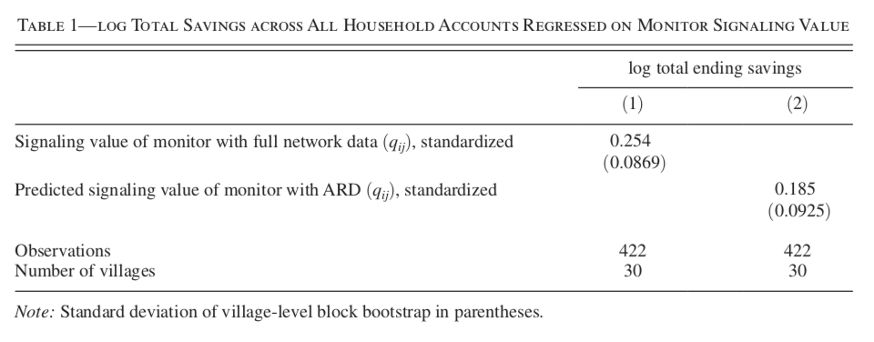

```{r setup, include=FALSE}
rm(list=ls())
knitr::opts_chunk$set(
  echo = FALSE, 
  message = FALSE, 
  out.width=400,
  fig.align="center"
)
```

# Motivation

Both papers address the issue that network data is often very expensive, difficult or simply infeasible to collect. The primary complication in collecting network data stems from the fact that it is typically necessary to collect data on each individual in the network and for each of them gathering information about their relationships to other individuals. 

# Contribution

Previous work on network data accessibility focused on central nodes or specific aspects of the network data. The methodology proposed in @breza2020using can instead be used to recover the entire distribution of the network. @de2019identifying propose a parsimonious frequentist approach to extract information about social networks from observational panel data.

# Brief summary

## @breza2020using

To solve the issue of inaccessibility of network data, @breza2020using propose that researchers collect aggregated relational data (ARD). They show that network data derived from ARD comes with a significant cost reduction. 

The ARD methodology can be summarized as follows: collect ARD on a subset of all nodes as well as a set of covariates describing individual characteristics of all nodes in the network. Essentially the approach then boils down to forming the network on a latent space based both on the ARD and the covariates. Links between nodes in the latent space are formed based on their pair-wise distances in the latent space: the closer any two nodes are together, the more likely they are to form a link.

To demonstrate that their approach works, the authors show that they can use networks derived from ARD to replicate findings of previous studies that used expensive network data. For example, the first study they look at investigates how peer effects affect saving behaviour of individuals. It finds that individuals who are aware that their saving behaviour may be monitored are more likely to save. Using the network derived from ARD @breza2020using manage to produce estimates very close to those obtained in the original study (Figure @breza2020using). The authors further show that the total data collection costs went down from \$189,164 for the original study to \$34,512 using ARD.

```{r study1, fig.cap="Replication of results from previous study."}

```

One limitation of their proposed approach is that conclusions about the true existence of individual links cannot be made. Therefore the authors confess that if knowledge about individual links is required, researchers will still have to specifically gather that information. Another concern the authors point to is the fact that the network formation is parametric and therefore subject to specific assumptions.

## @de2019identifying

The approach proposed by @de2019identifying does not rely on any explicit data on network links at all:

> "[...] global identification of the en- tire structure of social networks is obtained, using only observational panel data that itself contains no information on network ties"
--- @de2019identifying

Panel data here does not necessarily include a time dimension, but could instead involve a cross-section of individuals $n=1,...,N$ observed across some other discrete cross-section of instances $t=1,...,T$. With such a panel at hand @de2019identifying propose estimating a canonical structural model of social interactions:

\begin{equation} 
\begin{aligned}
&& y_{i,t}&=\rho_0 \sum_{j=1}^{N} W_{0,ij}y_{jt} + \beta_0x_{it}+\gamma_0 \sum_{j=1}^{N} W_{0,ij} x_{jt} + \alpha_i + \alpha_t +\epsilon_{it} \\
\end{aligned}
(\#eq:canon)
\end{equation}

where $\alpha_i$, $\alpha_t$ are entity fixed effects and the main parameter of interest $W_{0,ij}$ measures the causal impact of individual $j$ on the outcome of individual $i$. The authors show how $W_0$ along with the parameters measuring exogenous and endogenous peer effects ($\rho_0$ and $\gamma_0$, respectively) can be identified.

In order to test their proposed methodology the authors simulated random network structures through synthetic data and check how well their approach approximates the true parameters of interest ($W_0$, $\rho_0$, $\gamma_0$). Finally, they also apply their methodology to a real data set on tax competition between US states. Through the simulation exercises they demonstrate that their approach can accurately recover network structures. The empirical exercise on real data provides some evidence that their proposed model can also help uncover previously undisclosed findings from data.

# References